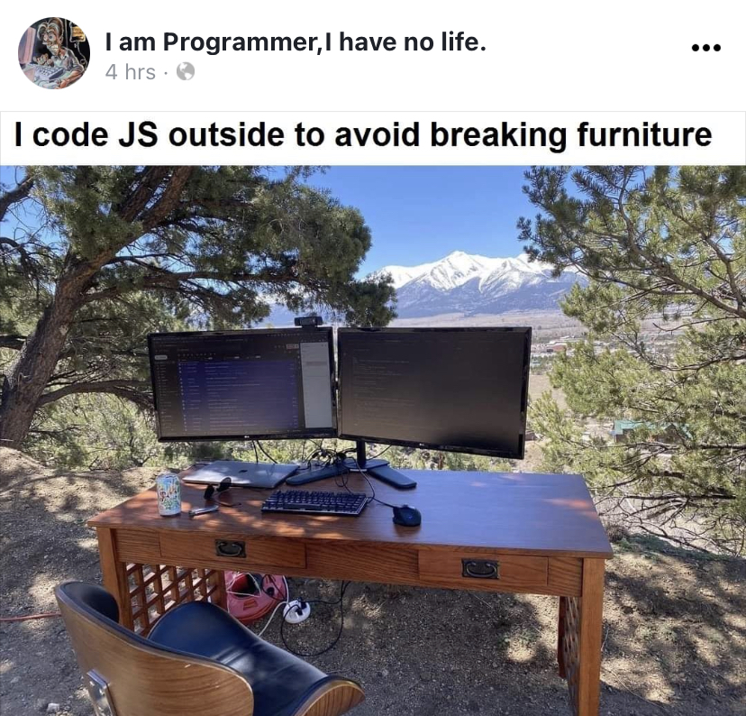

Briefly describe your system (e.g. A store selling Pokemon game cards)
This is a Make an Academic Profile application, intended for CIS PHD students to track their progress, make CV, or fill in the database that I am maintaining for my research, in order to visualize this and other data as graphs.
Any notable shortcomings, bugs, problems, or additional features not implemented?
The app is far from perfect. It kind of acts out, like when I add things to my profile (shopping cart), and click on that link they are not there, but once I click again, it is there. So some thighs are not as polished as I would like them to be. I didn’t manage to make the forms sticky, nor to send the email.
Describe what you are most proud of about your system:
I am most proud of myself because now I know that I can actually make a front-end app that would fulfill the abovementioned task for my research, in case I want to make this into a functional prototype. Also, it kind of looks nice, so that is good.
Describe what you are least happy with your system:
The things I already mentioned above. Also, I wish I have made the whole form I will use to collect the data from CIS students.
How was developing this assignment different than assignment #2?
We used sessions and cookies, and it took me a while to comprehend what is going on with that, even if the professor kept repeating, it didn’t quite sink in how to use the 2.
When you ran into a problem, what did you do to address it?
I would google first, try out different things, write to the professor, make appointments with him (the most useful option, by far), or listen in his meetings with others.
Describe what worked well in doing this assignment?
I think I kind of got a hang of thinking how to write if loops, and that worked well in few cases.
Describe what did not work well in doing this assignment?
I didn’t manage to make a function that will create a navbar, so I had to repeat the code and modify it on all of my pages. Big fail.
What did you learn from doing this assignment?
I learned about cookies and sessions, and how they work. Also, server-side programming and routs, pretty powerful stuff.
If you could go back in time and do things differently, what would you change?
Not much, I would probably make the function for the navbar, and polish my code, do the emailing option. If I were to make the semester-long project out of this, I wouldn’t do the Ties page (it is kind of useless, but I needed to do the quantities input box requirement so I did it anyway) but would do the actual full form that has many dependencies.
Estimate the % of time you spent (a) thinking about how to do something, (b) writing code (but do not include testing, (c) testing and debugging
This is just to answer, but actually, I have no idea, it was all mixed up.
Thinking - 33%
Writing - 33%
Testing - 33%
Assign an estimated percentage on the amount each team member contributed to the assignment (including yourself) and explain briefly your rationale for the percentage breakdown. Be sure to include an overview of what specifically you and your partners contributed (e.g. “I worked on the security and my partner 1 worked on personalization”)
NA
Dealing with this assignment is what I imagine being bipolar may look like. At first a huge down and willlessness and a sense of incapability, and after the consultation, I started figuring out how to do things and I felt really good about it and smart and proud, and now it's getting down again when I get stuck again, etc.
Anyway, I think this class was very useful for me and I am happy I took time and effort to go through it, as I did ponder on dropping it and taking the easy way out. 
Mahalo for all of your efforts,
Stasha

